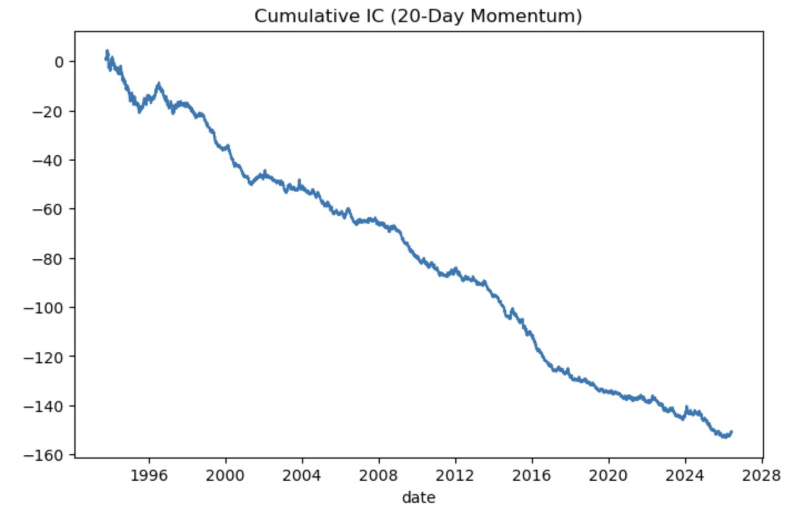

# A-Share Momentum Factor: Cross-Sectional IC & Long-Short Backtest

Tests whether the 20-day momentum factor has cross-sectional predictive
power on CSI 300 constituents, using akshare data.

## Method
- Data: CSI 300 constituents (~280 stocks after filtering), daily prices via akshare
- Factor: 20-day momentum (`pct_change(20)`); target: next-day return
- Look-ahead bias controlled (factor uses past window, return shifted forward)
- Cross-sectional Rank IC computed per day; ICIR and hit rate aggregated
- Long-short backtest: long bottom 20% / short top 20%, with cost sensitivity

## Key Results
- IC mean: -0.0189, ICIR: -0.0768, hit rate: 46.86%
- Cumulative IC declines monotonically over ~30 years → stable **reversal** effect
- Long-short Sharpe ≈ 0.20 (no cost); turns negative once cost > ~0.05%



## Conclusion
The 20-day momentum factor shows a robust negative IC (short-term reversal,
opposite to US momentum), but the long-short premium is fully eroded by
realistic transaction costs.

## Limitations
Raw factor, no industry/size neutralization; equal-weight long-short.

## Usage
```bash
pip install akshare pandas numpy matplotlib
python momentum_ic.py
```
